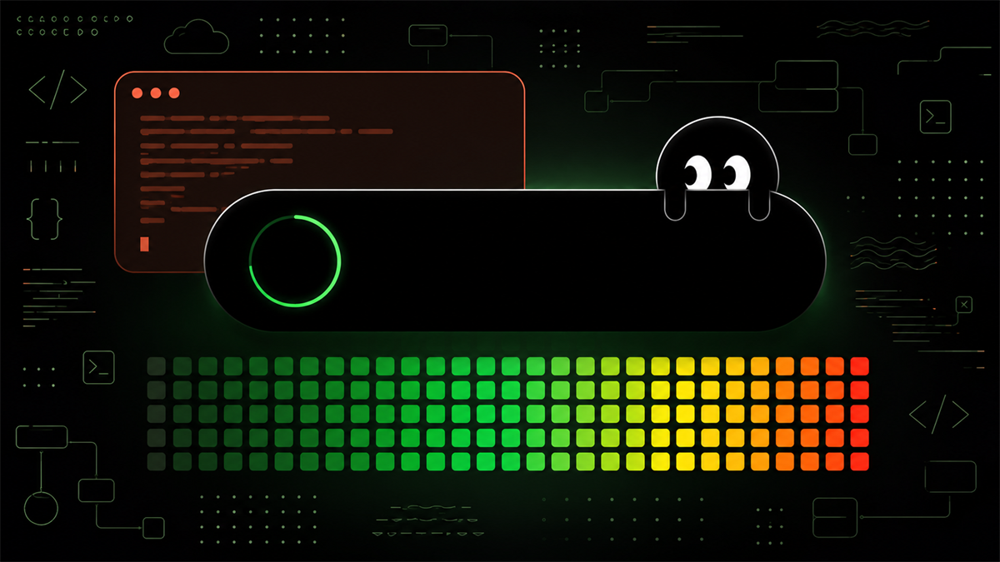

<p align="center">
  
</p>

<h1 align="center">Perch</h1>

<p align="center">
  <a href="https://github.com/ErikPervious/Perch/releases/latest"></a>
  
  
  <a href="LICENSE"></a>
</p>

Uma Dynamic Island para Windows que mostra o uso da sua sessão do Claude Code.
Fica escondida no topo da tela, desce com um atalho, expande no hover — e desce
sozinha quando você está queimando cota rápido demais.

*Perch* é poleiro: a ilha fica empoleirada na borda de cima da tela, e o bicho se
pendura ali. O nome do produto não usa "Claude" de propósito — é marca da
Anthropic. Descrever o que o app faz é uso nominativo e segue tranquilo.

---

## Demonstração

https://github.com/user-attachments/assets/c28877c8-ff1f-4316-be5a-714a5f6e83b4

A descida com o overshoot da mola, o painel expandindo no hover, os três
formatos, o alerta com tremor — e o bicho acompanhando o cursor até se assustar
quando ele chega perto.

Gravado a 60fps com `npm run dev -- --reel`, que executa essa coreografia com
tempos fixos.

---

## Instalação

Baixe o **[instalador na última release](https://github.com/ErikPervious/Perch/releases/latest)**.
Ele instala em `%LOCALAPPDATA%` sem pedir administrador, com atalho no menu
iniciar e desinstalador. Há também uma versão portátil, que roda direto sem
instalar nada.

Windows 10 ou 11, 64 bits. O executável não é assinado — veja
[SECURITY.md](SECURITY.md) para o porquê e para o que exatamente o app lê e
escreve.

O ícone aparece na bandeja. Abra **Configurações → Conexão com o Claude Code →
conectar**, inicie uma sessão do Claude Code **no terminal** e mande uma
mensagem. Os números começam a aparecer.

> O aplicativo de desktop não serve para alimentar o Perch: a statusLine é um
> recurso do terminal, e na interface gráfica ela nunca é executada. O painel
> avisa quando detecta essa situação.

Nenhum comando de terminal, e o Node **não** precisa estar instalado.

> Se você tinha a versão anterior chamada *Claude Island*, o app migra sozinho:
> reconhece a instalação antiga, reescreve o caminho no `settings.json` e traz
> `state.json` e `config.json` para `%LOCALAPPDATA%\Perch\`, preservando o
> histórico de amostras.

---

## De onde vêm os números

Do próprio Claude Code, por um canal oficial: o campo `rate_limits` do
**statusline**, disponível desde a versão 2.1.80.

```
rate_limits.five_hour  = { used_percentage: 0-100, resets_at: epoch_seconds }
rate_limits.seven_day  = { used_percentage: 0-100, resets_at: epoch_seconds }
```

É o mesmo número que o `/usage` mostra. Não é estimativa, não usa credencial e
não bate em endpoint privado.

Isso importa porque **a porcentagem não fica salva em disco em lugar nenhum**. O
Claude Code busca da API, desenha e descarta. Não existe arquivo para ler depois
— o statusline é a única forma de um programa de fora receber esse número.

```
Claude Code ──stdin JSON──▶ statusline.cmd ──▶ statusline.js ──▶ state.json ──▶ ilha
                                   │
                                   └──▶ statusline no seu terminal
```

O bridge também imprime uma linha de status no terminal, então você ganha algo
em vez de só ceder:

```
Opus 5 · obsian · 5h 27% ↻2h58 · 7d 54% · ctx 53%
```

Em paralelo, a ilha observa os transcripts em `~/.claude/projects/**/*.jsonl`
para a **Live Activity** — como esses arquivos são escritos enquanto o Claude
responde, ela sabe em tempo real que há uma sessão gerando agora, e monta o
gráfico dos últimos 7 dias.

### Limitações honestas

- **Só sessões de terminal alimentam o Perch.** A statusLine desenha uma linha
  abaixo do prompt no TUI; no aplicativo de desktop esse lugar não existe e o
  comando nunca é executado. Se você usa só a interface gráfica, o Perch fica
  sem número — e o painel detecta e explica isso, em vez de dizer "conectado" e
  não entregar nada.
- Com nenhuma sessão aberta a ilha continua o countdown correto (usa
  `resets_at`), mas a porcentagem congela na última leitura — e o rodapé passa
  a dizer há quanto tempo o dado é, em vez de fingir que está vivo.
- `rate_limits` só aparece **depois da primeira resposta da API** na sessão, e
  só para assinantes. Antes disso a ilha mostra "aguardando a primeira resposta".
- Uso feito no claude.ai ou no app desktop **não** aparece. Só Claude Code.

### Como o bridge roda sem Node instalado

O botão *conectar* faz backup do seu `~/.claude/settings.json` com timestamp e
grava:

```json
"statusLine": {
  "type": "command",
  "command": "\"%LOCALAPPDATA%\\Perch\\statusline.cmd\"",
  "padding": 0,
  "refreshInterval": 10
}
```

Se você já tiver um `statusLine` próprio, o painel **avisa e não sobrescreve** —
o botão passa a dizer *substituir* e a decisão é sua.

Esse `.cmd` é gerado pelo app, e existe por um motivo específico. O Claude Code
precisa **executar** o bridge, e um app empacotado não pode exigir Node na
máquina. A saída é o próprio executável rodando em modo Node (`ELECTRON_RUN_AS_NODE`)
— o Electron já embute um.

Só que nesse modo o processo é de subsistema GUI: escrever no stdout quando ele
é um **pipe** estoura `EPIPE`, mas redirecionar para **arquivo** funciona. Por
isso o shim manda a saída para um temporário e devolve com `type`. O `chcp 65001`
preserva os acentos e o `↻`.

Custa 128ms por invocação, contra 61ms chamando `node` direto — aceitável para
algo que roda a cada 10 segundos, e sem dependência nenhuma.

O shim é regravado a cada inicialização, e se o `settings.json` estiver apontando
para um caminho velho o app conserta sozinho. Sem isso, atualizar ou mover o app
deixaria o Claude Code chamando um caminho morto e a ilha ficaria muda sem
explicar por quê.

---

## Uso

| Ação | Resultado |
|---|---|
| `Ctrl + Alt + J` | desce / recolhe a ilha |
| `Ctrl + Alt + K` | abre direto nos detalhes |
| `Ctrl + Alt + L` | cicla o formato: card → barra → pílula |
| Mouse sobre a ilha | expande para o painel completo |
| Clique | trava aberta (clique de novo para destravar) |
| Engrenagem no canto | abre o painel de configuração |
| Ícone da bandeja | clique mostra a ilha; botão direito abre o menu |

A ilha é **click-through**: quando o cursor não está sobre ela, os cliques passam
direto para a janela que estiver embaixo.

Se um atalho estiver ocupado, o app desce uma lista de alternativas até achar uma
livre e **mostra qual ficou valendo** no menu da bandeja, em vez de falhar em
silêncio. Dá para gravar a combinação que quiser no painel — ele testa antes de
salvar, registrando e desregistrando na hora, porque o Windows não tem API para
consultar se um atalho está livre.

### Por que J, K e L

`Ctrl+Alt+Space` era o padrão original e estava **ocupado** nesta máquina. Foram
testadas 35 combinações; quase todas livres. A escolha veio de duas restrições
que um teste de conflito não pega:

- `Ctrl+Shift+Space` está fora porque o VS Code usa para dicas de parâmetro — e
  um atalho global **rouba** do aplicativo em foco.
- No teclado **ABNT2 o AltGr é literalmente Ctrl+Alt**. `Ctrl+Alt+Q` mataria a
  barra `/`, `Ctrl+Alt+W` o `?`, `Ctrl+Alt+E` o `€`, `Ctrl+Alt+C` o `₢`, e os
  números 1 a 3 os expoentes. `J`, `K` e `L` não geram caractere com AltGr. O
  painel avisa se você gravar uma das perigosas.

---

## O que a ilha mostra

**Pílula** — ponto colorido e a porcentagem do bloco de 5h. O mínimo.

**Barra** — só a régua de progresso, esticada na horizontal. Aqui comprimento é
vantagem: quanto mais longa, mais resolução tem cada ponto percentual. O corpo da
ilha é a pista e o preenchimento cresce por dentro, com um fio aceso na ponta —
é ele que dá a leitura instantânea de "estou aqui" sem precisar comparar bordas.

**Card** — anel de progresso, tempo até renovar, ritmo em %/min, horário projetado
de esgotamento, sparkline do bloco e barra do limite semanal.

**Detalhes** (no hover, em qualquer formato) — tudo acima mais o veredito
(`dá até o reset` / `acaba antes do reset`), o contexto da sessão ativa com
projeto e modelo, e o gráfico dos últimos 7 dias.

**Live Activity** — waveform animado enquanto uma sessão está gerando, com
intensidade proporcional aos tokens de saída por segundo. Só aparece com a ilha
**já visível**: descer a cada mensagem gerada seria insuportável. Ligue
`idleVisible` se quiser vê-lo o tempo todo.

O veredito tem cor própria, independente do nível de uso. Um "acaba antes do
reset" pintado de verde porque você está em 54% comunicaria o contrário do que é.

---

## Quando ela desce sozinha

- Ao cruzar **50%, 75%, 90% e 95%** do bloco de 5h — uma vez cada, por janela.
- Ao cruzar **75% e 90%** do limite semanal.
- **Ritmo anômalo**: quando a velocidade de queima passa de 2,5× o ritmo típico
  do bloco **e** a projeção indica estouro antes do reset. Esse vem com tremor.
- **Renovação**: quando o bloco de 5h zera, ela desce em verde avisando.

Há um intervalo mínimo de 90 segundos entre descidas automáticas. Um aviso que
aparece demais deixa de ser aviso.

Os degraus que a janela **já passou** são marcados como disparados sem alertar.
Sem isso, abrir o app com a sessão em 85% dispararia 50% e 75% retroativamente —
avisos sobre um passado que você não pode mais mudar. Numa janela realmente nova
o uso é ~0, então nada é marcado e todos os degraus continuam valendo.

O ritmo não vem de somar tokens: é a **derivada** de `used_percentage` por
regressão linear numa janela móvel de 12 minutos. O backend já entrega o número
ponderado, então derivar dele é mais fiel que reponderar tokens na mão.

---

## O bicho

Fica pendurado na borda de cima da tela, de cabeça para baixo, ao lado da ilha.
Acompanha o cursor com os olhos e pisca em intervalos irregulares — uma em cada
quatro é dupla, e é a irregularidade que parece vivo.

Ele **espia**: só a metade de baixo dos olhos e a coroa da cabeça descem para
dentro da tela, como quem olha por cima de um parapeito sem botar a cabeça toda
para fora. Não há truque de recorte — o elemento é deslocado para cima
exatamente o centro do olho, e a borda da janela corta o resto do corpo.

E ele é tímido: se o cursor chega a menos de 96px, se recolhe inteiro e espera
quase um segundo antes de voltar. Fugir usa mola seca, voltar usa mola macia —
sai correndo e volta desconfiado.

O olhar usa a posição **global** do cursor, lida pelo processo principal a 30Hz e
só enquanto há algo visível. O `mousemove` do renderer não serve sozinho: ele só
dispara com o ponteiro dentro da janela de 760×360 no topo da tela, então os
olhos congelariam na maior parte do tempo. O alcance da pupila é calculado a
partir do tamanho dela no momento — dilatada, anda menos para não encostar na
borda do branco.

Ele não é enfeite: **o humor carrega estado**.

| Humor | Quando | Como aparece |
|---|---|---|
| sonolento | sem sessão gerando há mais de 1 min | pálpebras a meio-pau, balanço lento |
| normal | tocando o barco | — |
| atento | Claude gerando agora | pupilas menores, balanço mais vivo |
| alarmado | acima de 85%, ou alerta crítico | pupilas dilatadas, olhos arregalados, susto no pêndulo |

O balanço não é uma animação separada: quando a ilha muda de tamanho, o impulso é
calculado a partir da variação de largura e injetado na mola do pêndulo. Um morph
pequeno mal balança; abrir os detalhes de vez sacode.

---

## Painel de configuração

Passe o mouse sobre a ilha e uma engrenagem discreta aparece no canto — a meio
tom, opaca só quando você aponta para ela. Abre uma janela centralizada.

Tudo salva na hora; não há botão de aplicar.

| Seção | O que tem |
|---|---|
| Conexão com o Claude Code | estado do bridge, conectar / desconectar |
| Aparência | tema escuro ou claro, formato padrão, em qual monitor |
| Atualizações | verificar novas versões, e verificar agora |
| Atalhos | gravador de combinação, com teste de conflito e alerta de AltGr |
| Comportamento | descer sozinha, pílula ociosa, Live Activity, tempo na tela |
| O bicho | mostrar, espiar sozinho, fugir do mouse |
| Horários | faixa de horas e dias da semana |

Os horários valem só para **aparições automáticas** — o atalho funciona sempre.
Faixas que atravessam a meia-noite (`22:00` até `02:00`) são suportadas.

---

## Como o movimento é feito

Sem biblioteca de animação. A janela do sistema **nunca** redimensiona: é fixa em
760×360 e totalmente transparente, e o que se move é uma `div` dentro dela,
dirigida por um integrador de mola em `src/renderer/spring.js`.

Isso importa por dois motivos. Redimensionar a janela do SO a cada frame é o que
faz esse tipo de app parecer travado. E mola não é o mesmo que `cubic-bezier`:
uma curva de easing interpola entre dois pontos num tempo fixo, enquanto a mola
preserva a velocidade atual quando o alvo muda no meio do caminho. É daí que vêm
o peso e o overshoot.

Abrir usa mola macia, que passa um pouco do ponto. Fechar usa mola seca, porque
overshoot ao recolher parece bug. A fusão da bolha no corpo durante o alerta é um
filtro SVG (`feGaussianBlur` + `feColorMatrix`) aplicado **só** na camada das
formas pretas — o texto fica numa camada irmã sem filtro, senão borraria.

### Suavidade, medida

```bash
npm run dev -- --fps --stress
```

Liga um contador de frames e um modo que fica trocando de estado a cada 700ms,
para a medição cair em cima dos morphs. A média não serve de nada aqui: 59fps de
média com um frame de 90ms no meio é exatamente a travada que o olho pega. O que
importa é a cauda.

Resultado num monitor de 240Hz (orçamento de 4,16ms por frame):

```
mediana 4.2ms · p95 4.3ms · pior 70.9ms · 1/466 frames >20ms   ← primeiros 2s
mediana 4.2ms · p95 4.3ms · pior  4.3ms · 0/481 frames >20ms   ← daqui em diante
mediana 4.2ms · p95 4.3ms · pior  4.3ms · 0/481 frames >20ms
```

Da primeira abertura em diante: **zero frames perdidos**, com p95 colado na
mediana, mesmo sob morph contínuo. O pico de 70ms nos primeiros 2 segundos é
custo de inicialização do processo gráfico — aparece igual com **0 morphs** e a
ilha escondida, que é o estado real logo após o launch. Você não o vê.

Três coisas foram necessárias para chegar nesses números, e todas vieram da
medição, não de palpite:

- **O brilho tem tamanho fixo e só é esticado por `scale`.** Ele carrega um blur
  de 22px, e redimensionar um elemento borrado obriga o compositor a repintar o
  blur inteiro todo frame.
- **Nada de I/O síncrono no processo principal**, que é o mesmo que coordena a
  composição da janela. A varredura do histórico lia 72 transcripts com
  `readFileSync`, um deles de 15MB. Hoje é assíncrona e cede o event loop a cada
  lote de linhas; e o tique de 1,2s só olha os arquivos quentes, em vez de fazer
  `readdir` recursivo mais 822 `stat` toda vez.
- **Pré-aquecimento no boot.** Com a ilha em opacidade 0.01 — zero faz o
  compositor descartar a camada e o aquecimento não acontece — cada estado é
  rasterizado uma vez antes de você ver qualquer coisa.

Com tudo parado e a ilha escondida, o loop sai cedo em vez de reescrever CSS vars
240 vezes por segundo para mover nada.

---

## Estrutura

```
bridge/statusline.js       recebe o JSON do Claude Code e grava state.json
scripts/make-icon.js       gera build/icon.ico a partir de código

src/main/index.js          janela, bandeja, atalhos globais, IPC
src/main/bridge.js         instala/remove o statusLine e mantém o shim
src/main/usage.js          observa state.json e deriva ritmo/projeção/anomalia
src/main/transcripts.js    Live Activity e histórico de 7 dias
src/main/triggers.js       decide quando a ilha desce sozinha
src/main/config.js         preferências, com faixa de horário
src/main/paths.js          caminhos e migração do nome antigo
src/main/icon.js           encoder PNG e ICO escritos à mão

src/preload/index.js       ponte da ilha
src/preload/settings.js    ponte do painel

src/renderer/island.js     máquina de estados e loop de render
src/renderer/spring.js     integrador de mola e impulso amortecido
src/renderer/critter.js    o bicho: espiar, olhar, piscar, humor, pêndulo
src/renderer/settings.*    painel de configuração (janela própria)
```

Dados e preferências ficam em `%LOCALAPPDATA%\Perch\`.

---

## Desenvolvimento

```bash
npm install
npm run dev
```

| Flag | O que faz |
|---|---|
| `--show` | abre no formato configurado, sem depender do atalho |
| `--demo` | abre já nos detalhes |
| `--settings` | abre o painel de configuração |
| `--fps` | contador de frames (mediana, p95, pior, frames >20ms) |
| `--stress` | fica trocando de estado a cada 700ms |
| `--reel` | executa uma coreografia com tempos fixos, para gravar demonstração |
| `--dev` | abre o DevTools numa janela separada |

Qualquer uma delas liga o repasse do console do renderer para o **stderr** — sem
isso, um erro de módulo no renderer some sem deixar rastro. Precisa ser stderr:
no Windows o Electron é app de subsistema GUI e o stdout do processo principal
não chega em quem redirecionou.

### Gravar uma demonstração

```bash
npm run dev -- --reel
```

Executa uma coreografia com tempos fixos — descida, detalhes, barra, pílula,
alerta com tremor, e o cursor se aproximando do bicho para ele fugir. Acertar
isso ao vivo exigiria muitas tomadas; assim é uma só, e repetível.

Grave com um capturador de tela de verdade (Xbox Game Bar, `Win+Alt+R`, já vem
no Windows; ou ScreenToGif, que permite recortar a região). Sai MP4 com
aceleração de GPU a 60fps, que é o que se quer para publicar.

> A janela é transparente: **o que estiver na tela vai para o vídeo**. Limpe a
> área de trabalho antes. Se preferir um fundo opaco no lugar do papel de
> parede, acrescente `--backdrop`.

O **cursor é sintético**, seguindo uma trajetória coreografada. No vídeo
ninguém vê o mouse de quem grava, então sem isso o olhar do bicho ficaria
parado. A trajetória passa longe dele até os 9s e se aproxima uma vez só —
na primeira tentativa o arco passava perto o tempo todo e ele ficava escondido
no vídeo inteiro.

#### Capturador próprio

Há também um capturador no repositório, que dispensa gravador externo:

```bash
powershell -ExecutionPolicy Bypass -File scripts/record-reel.ps1
node scripts/encode-mp4.js --from 203 --to 1190 --crf 16
```

Grava BGRA cru a **60fps** — codificar PNG dentro do laço derrubaria para uns
10fps, e a mola vive nos primeiros 200ms de cada morph, que é onde a taxa
importa. São ~100MB de frames crus por segundo de vídeo; confira o disco antes.

O `encode-mp4.js` precisa de ffmpeg instalado (`winget install Gyan.FFmpeg`) e
produz H.264. Sem ffmpeg, o `encode-gif.js` funciona sem dependência nenhuma,
mas a paleta de 256 cores do GIF arruína os degradês e o neon — serve para
conferir animação durante o desenvolvimento, não para publicar.

O tempo de boot varia, então grave com folga e apare por índice de frame. Para
achar os cortes sem chutar, meça: com o papel de parede visível, contar pixels
claros não distingue nada, mas a **diferença entre frames consecutivos** isola
a ilha, já que o fundo é estático.

### Compilar

```bash
npm run build
```

Sai em `dist/`: o instalador NSIS e o portátil. O ícone é gerado por código —
um `.ico` de 7 tamanhos montado com o mesmo encoder PNG escrito à mão que desenha
o ícone da bandeja, sem `sharp` nem `canvas`.

O `bridge/` vai em `extraResources`, **fora do asar**: o Claude Code precisa
executar aquele arquivo, e nada executa de dentro de um asar.

O build **não é assinado**. Na primeira execução o SmartScreen avisa que o autor
é desconhecido — *Mais informações → Executar assim mesmo*. Assinar exigiria um
certificado de code signing pago.

---

## Configuração

Pelo painel, ou direto em `%LOCALAPPDATA%\Perch\config.json`:

| Chave | Padrão | O que faz |
|---|---|---|
| `shortcut` | `Control+Alt+J` | atalho principal |
| `detailShortcut` | `Control+Alt+K` | abre nos detalhes |
| `formatShortcut` | `Control+Alt+L` | cicla o formato |
| `theme` | `dark` | `light` para corpo branco |
| `format` | `card` | `bar` ou `pill` |
| `autoDrop` | `true` | descer sozinha nos alertas |
| `idleVisible` | `false` | manter a pílula visível quando ocioso |
| `liveActivity` | `true` | waveform enquanto o Claude gera |
| `critter` | `true` | o bicho espiando ao lado da ilha |
| `critterAuto` | `false` | espiar mesmo com a ilha escondida |
| `critterShy` | `true` | fugir quando o cursor chega perto |
| `peekMs` | `4200` | quanto tempo o alerta fica na tela |
| `display` | `primary` | `cursor` para seguir o monitor ativo |
| `schedule` | desligado | `{ enabled, from, to, days }` |

Se editar à mão, salve **sem BOM**. O app remove o BOM na leitura justamente
porque Bloco de Notas e `Out-File -Encoding utf8` gravam com ele e o `JSON.parse`
engasga — antes dessa guarda, editar o arquivo zerava todas as preferências em
silêncio.

---

## Atualizar

O app verifica se há versão nova 20 segundos após abrir e depois a cada 6
horas. Quando encontra, o painel mostra **o que mudou antes de você baixar** —
as notas da release renderizadas ali mesmo, porque o instalador do Windows não
tem tela de changelog. A bandeja também ganha um item de atualizar.

O aviso na ilha aparece **uma vez por versão**, não a cada abertura, e respeita
a faixa de horários. Atualização não é urgente como cota em 90%; se ela
sequestrasse a ilha do mesmo jeito, desvalorizaria o alerta que importa.

Baixar e instalar continua sendo seu: o app abre a página da release, e o
instalador atualiza por cima preservando configurações e a conexão do bridge.
A versão portátil não se atualiza sozinha — ela avisa, mas trocar o arquivo é
manual.

Essa verificação é a **única requisição de rede** do app, e desligável em
**Configurações → Atualizações**. Detalhes do que exatamente é enviado (nada)
em [SECURITY.md](SECURITY.md).

## Desinstalar

Pelo painel, **Conexão com o Claude Code → desconectar**, que remove a entrada do
`settings.json`. Depois é o desinstalador normal do Windows.

Os backups do `settings.json` continuam em `~/.claude/` como
`settings.json.perch-backup-*` e nunca são apagados automaticamente.
